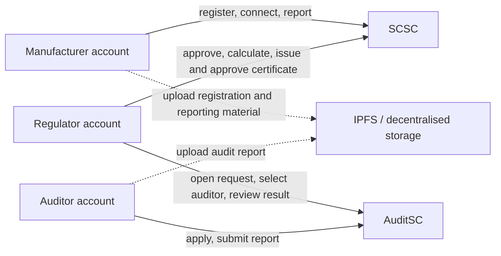

# Cement Sustainability Framework prototype

This repository accompanies [*Blockchain-based certification of sustainable cement production*](https://doi.org/10.1108/SASBE-08-2024-0291). It provides the Solidity implementation and a reproducible local walkthrough for the paper's certification workflow, organised around registration, reporting, auditing and certification.

The framework is deliberately modular. The paper presents its registration, reporting, auditing and certification pattern as adaptable to other energy-intensive industries and regulatory settings.

## Purpose and contribution

`CSF_vLatest.sol` contains two contracts compiled with Solidity `^0.8.26`.

| Contract | What the code records |
| --- | --- |
| `SCSC` | Manufacturer details, registration and sensor status, cumulative emissions and production, IPFS report identifiers, and certificates. |
| `AuditSC` | Audit requests, applications, the selected auditor, an IPFS hash for an audit report, and pass/completion/approval flags. |

The regulator deploys both contracts and coordinates the workflow: approving registration, overseeing reporting and calculation, opening audit requests, selecting an applicant, reviewing the audit outcome, and issuing and approving certificates. `SCSC` and `AuditSC` retain their own state, so the runnable example follows the sequence through the regulator's operating procedure.

This is a simplified map of the repository's contract interactions. For the full system architecture and stage-by-stage sequences, see Section 4.2 and Figures 3–7 of the [article](https://doi.org/10.1108/SASBE-08-2024-0291). The dotted arrows show the supporting document uploads to IPFS in that wider workflow.



The paper's wider architecture includes CEMS, smart meters, oracles and IPFS. This Solidity snapshot models the on-chain records and calls: it receives IPFS identifiers as strings and records a manufacturer sensor-connection status. Equipment integration, oracle operation and IPFS-content handling sit in the surrounding application and operating process.

## Quick start: run the local verification

The verification suite compiles and exercises the archived source in Hardhat 3.18.0's in-process EDR-simulated local network (chain ID 1337). It uses local test accounts, needs no wallet and does not contact a public blockchain. Git and Node.js 24.19.0 are required; install the Node version recorded in `.nvmrc`, then run:

```sh
git clone https://github.com/AmmarHummieda/CSF---Cement-Sustainability-Framework.git
cd CSF---Cement-Sustainability-Framework
npm ci
npm run verify
```

If the repository is already present, run the last two commands from its root directory. `npm run verify` checks the source hash, builds the contracts and runs the baseline and recorded-behaviour tests. The individual stages are available as `npm run check:source`, `npm run compile` and `npm test`.

Run `npm run demo` for a compact reporting, audit and certification sequence using placeholder IPFS strings. The example reports `1200` emissions units and `300` production units, then prints a reporting emission factor of `400`, a certificate score of `4`, and the completed approval states.

Compilation uses Solidity **0.8.26**, the optimiser with **200 runs**, **`viaIR: true`**, and **`evmVersion: "paris"`**. These are the reproducibility-harness settings for this checkout.

## Repository guide

- [Architecture and implementation map](docs/architecture.md) explains the roles, contract records and workflow coordination.
- [Walkthrough](docs/walkthrough.md) maps the regulator-led sequence exercised by the local demonstration and baseline test.
- [Source behaviour and local verification](docs/implementation-notes.md) explains the recorded arithmetic and state changes used in the runnable example.
- [Citation metadata](CITATION.cff) provides a machine-readable citation for the related research article.

## Scope of the runnable example

The local harness demonstrates the archived source using local accounts and placeholder identifiers. It makes the on-chain workflow inspectable:

- `connectSensors()` records a connection status, while monitoring and oracle processes belong to the wider architecture;
- IPFS strings refer to registration, reporting and audit material; and
- the regulator coordinates the audit and certification stages across the two contract records.

The harness verifies this archived source's local behaviour. It does not recreate historical gas measurements or external monitoring conditions reported in the research.

## Adapting the framework

The modular workflow provides a starting point for other industrial applications, such as aluminium or steel certification, and for different regulatory settings. Sections 3.2, 5.4 and 6 of the [article](https://doi.org/10.1108/SASBE-08-2024-0291) discuss this generalisation and the modifications an adopter would make.

An adapted version would tailor the stakeholder roles, data model, emissions and production metrics, thresholds, reporting cadence, certification rules, monitoring interfaces and deployment platform to the intended use. These adaptations can be developed in the Solidity source and surrounding application, then compiled, tested and deployed for that setting. Future repository versions can document and demonstrate those extensions while retaining the cement implementation as an identifiable research baseline.

## Related publication and citation

Please cite the peer-reviewed article when referring to the framework:

> Hummieda, Ammar; Moawad, Karim; Salah, Khaled; Omar, Mohammed; and Mayyas, Ahmad (2025). “Blockchain-based certification of sustainable cement production.” *Smart and Sustainable Built Environment*. https://doi.org/10.1108/SASBE-08-2024-0291

The article is available through its [DOI](https://doi.org/10.1108/SASBE-08-2024-0291).

## Source snapshot

The archived Solidity file is retained unchanged from Git commit [`6c6444005482fb11d86fa184786fa623cc23b128`](https://github.com/AmmarHummieda/CSF---Cement-Sustainability-Framework/commit/6c6444005482fb11d86fa184786fa623cc23b128). Its byte-level SHA-256 is `11fec39aafef28742ffd7e193cb54987a1b54c8bd7d9cc52dc5b14c4c1774bf3` (17,257 bytes, CRLF line endings).
